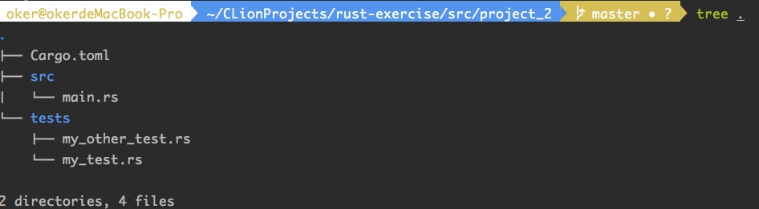

## cargo test

### 1 测试

Rust对**单元测试**和**集成测试**提供一流的支持。

测试详细说明传送门：https://doc.rust-lang.org/book/ch11-00-testing.html

在代码目录组织上，我们可以将单元测试放在需要测试的模块中，并将集成测试放在源码中 `tests/` 目录中：

```shell
# 新建项目project_2
cargo new project_2
```

在project_2中增加测试文件结构：



注：

- `tests`目录下每个文件都是一个单独的集成测试；
- `cargo`提供了一种便捷的方法运行所有的测试：

```shell
cargo test
```

举个单元测试的例子：

在src路径下创建一个lib.rs文件，里面写下两个简单的测试函数。结构框架照着这样写即可：


在终端中启动单测：

```shell
cargo test
```


如果不想启动全部单测，还可以进行**名称匹配**：

```shell
cargo test test_it_w
```


相当于只运行函数名为`test_it_w*`的test函数。可见`test_it_panics`并没有执行。

注：`cargo` 可能同时进行**多项测试**，因此请确保它们不会**相互竞争**。例如，如果它们都输出到文件，则应该将它们写入**不同的文件**。

### 2 构建脚本

有的时候我的crate在cargo编译成功之前需要一些**先决条件**。比如：代码生成或者需要编译的一些本地代码。

对于以上需求，cargo允许**构建可运行脚本**。

构建脚本需要在`Cargo.toml`指定它：

```toml
[package]
name = "project_2"
version = "0.1.0"
authors = ["MichaelWang <michael_wangguanyi@163.com>"]
edition = "2018"
build = "hello.rs" # 这里

# See more keys and their definitions at https://doc.rust-lang.org/cargo/reference/manifest.html

[dependencies]
```

跟默认情况不同，这里 cargo 将在项目目录中优先查找 `hello.rs` 文件。

#### 2.1 如何构建脚本

构建脚本只是另一个Rust文件，此文件将在编译包中的任何其他内容之前，**优先**进行**编译**和**调用**。 

因此，此文件可实现满足 crate 的先决条件。

cargo 通过此处指定的可以使用的环境变量为脚本提供输入。传送门：https://doc.rust-lang.org/cargo/reference/environment-variables.html#environment-variables-cargo-sets-for-build-scripts

