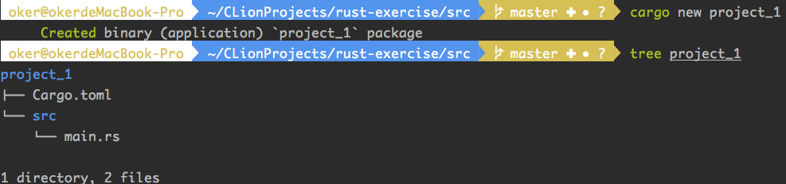
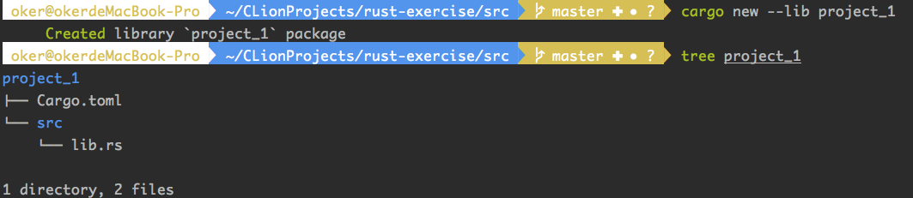
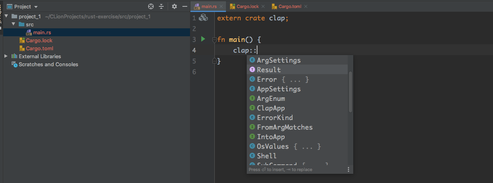
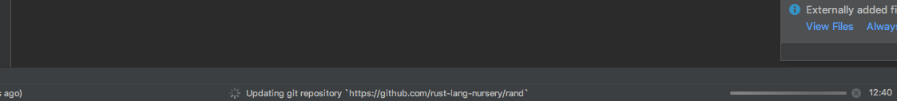
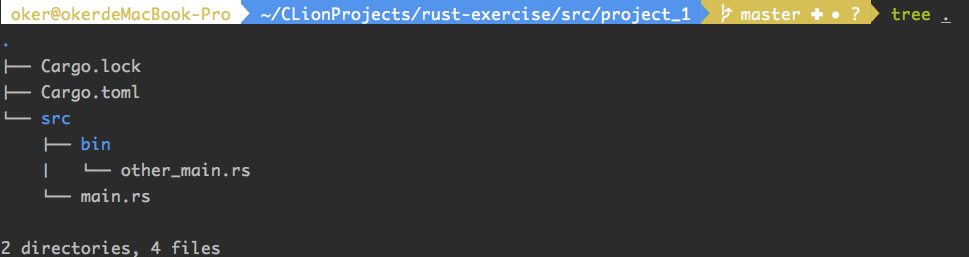
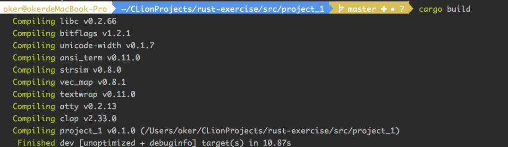
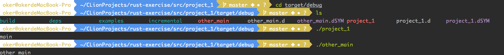
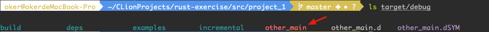

## cargo

`cargo`是官方的Rust**包管理工具**。

 它有很多非常有用的功能来提高代码质量和开发人员的开发效率！ 这些功能包括：

- 依赖管理和与 [crates.io](https://crates.io/)（官方 Rust 包注册服务）集成；
- 方便的单元测试；
- 方便的基准测试。

Ps. 可以在cargo 官方手册中查看详细内容：https://doc.rust-lang.org/cargo/

### 1 依赖

大多数程序都会依赖于**某些库**。

如果你曾手动管理过库依赖，那么你就知道这将会带来的极大的痛苦。

幸运的是，Rust 的生态链标配 `cargo` 工具。该工具可以快捷便利地管理**项目的依赖关系**。

首先利用cargo创建一个Rust项目：

```shell
# 二进制可执行文件
cargo new project_1

# 或者库
cargo new --lib project_1
```



或



以二进制可执行文件为例：

`main.rs`——是新项目的入口源文件；

`Cargo.toml` 是本项目（project_1）的 `cargo` 的配置文件:

```toml
[package]
name = "project_1"
version = "0.1.0"
authors = ["MichaelWang <michael_wangguanyi@163.com>"]
edition = "2018"

# See more keys and their definitions at https://doc.rust-lang.org/cargo/reference/manifest.html

[dependencies]
```

字段说明：

- `name`：表明项目的名称。如果要发布crate（后面将做更多介绍），那么 `crates.io` 将使用此字段**标明的名称**。 这也是编译时输出的二进制**可执行文件**的名称；
- `version`：使用[语义版本控制](http://semver.org/)（Semantic Versioning）的crate版本号；
- `authors`：表明发布 crate 时的作者列表；
- `dependencies`：允许为项目添加依赖。

使用举例：

假设我希望程序有一个很棒的命令行界面（command-line interface，CLI）。 你可以在crates.io（官方的 Rust 包注册服务）上找到很多很棒的 Rust 包。

crates.io传送门：https://crates.io/

其中有一个受欢迎的包是clap（译注：一个命令行参数的解析器）。

clap传送门：https://crates.io/crates/clap

现在clap最新发布的版本为 `2.33.0`。要在程序中添加依赖，可以很简单地在 `Cargo.toml` 文件中的 `dependencies` 项后面将以下内容添加进来 ：`clap = "2.33.0"`。

```toml
[package]
name = "project_1"
version = "0.1.0"
authors = ["MichaelWang <michael_wangguanyi@163.com>"]
edition = "2018"

# See more keys and their definitions at https://doc.rust-lang.org/cargo/reference/manifest.html

[dependencies]
clap = "2.33.0"
```

当然，在 `main.rs` 文件中需要写上 `extern crate clap`。这样就可以在你的main函数中使用clap了。 



`cargo` 还支持其他类型的依赖。

其他类型依赖说明：https://doc.rust-lang.org/cargo/reference/specifying-dependencies.html

 下面是一个简单的示例：

```toml
[package]
name = "project_1"
version = "0.1.0"
authors = ["MichaelWang <michael_wangguanyi@163.com>"]
edition = "2018"

# See more keys and their definitions at https://doc.rust-lang.org/cargo/reference/manifest.html

[dependencies]
clap = "2.33.0"
rand = { git = "https://github.com/rust-lang-nursery/rand" } # 来自github
test = { path = "../test" } # 来自本地文件的路径
```

在修改完Cargo.toml文件后，IDE会自动去网上同步：



`cargo`不仅仅是一个包依赖管理器。`Cargo.toml`的所有可用配置选项都列在格式规范中：

格式规范传送门：https://doc.rust-lang.org/cargo/reference/manifest.html

使用IDE同步有的时候会失败，最好的方法就是修改完`Cargo.toml`后用命令来执行依赖同步：

```
$ cargo build
```


也可以执行`cargo run`来构建和运行。

注：可以在项目目录中的任何位置（包括子目录）执行`cargo build`。上图就是在src子目录中执行的。

### 2 一个项目如何包含多个可执行二进制文件

正常的二进制可执行文件项目的生成目录层级结构为：


如果我想在同一个项目中有两个二进制可执行文件，要怎么做？（就是一个项目中有多个main.rs文件）

`cargo` 是支持这一点的。之前main.rs在编译后生成可执行文件`main`，可以通过将文件放在`bin/` 目录中来添加其他二进制可执行文件。

操作一遍，当前路径结构：



main.rs文件：

```rust
extern crate clap;

fn main() {
    println!("main");
}
```

bin/other_main.rs文件：

```rust
fn main() {
    println!("other main");
}
```

编译，直接

```shell
cargo build
```

自动下载依赖，并编译：



然后会在工程的**根路径**下生成一个target/debug路径，两个编译后的二进制可执行文件都在其中：



文件名为项目名`project_1`的可执行文件为main.rs编译生成，文件名为`other_main`为bin/other_main.rs编译生成。

如果只想单独生成bin/路径下的二进制可执行文件：

```shell
cargo build --bin other_main
```



此时只按照参数`--bin`指示的文件名进行编译。